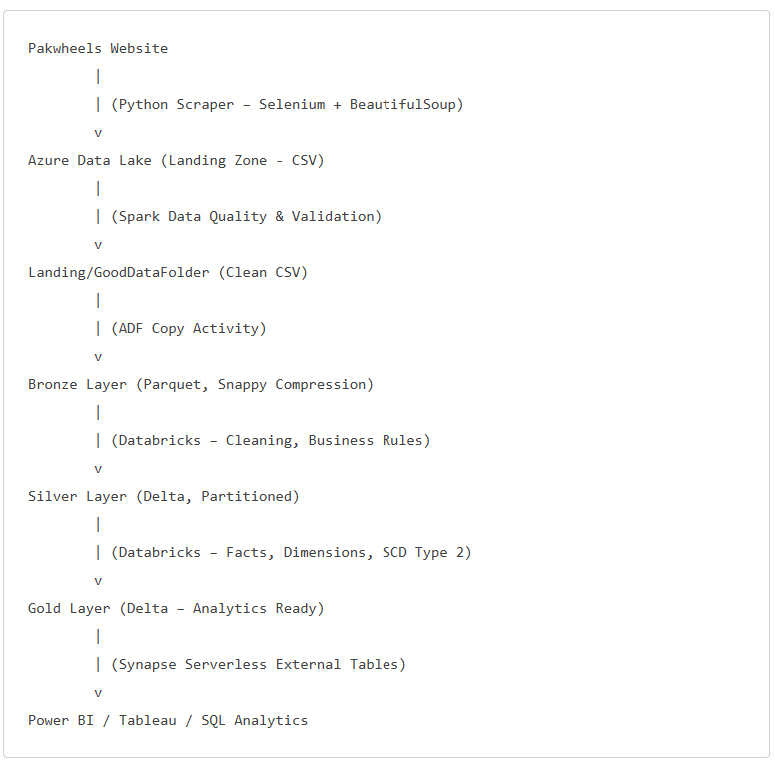

# 🚗 Used Car Analytics Platform – End‑to‑End Azure Data Engineering Project
## 📌 Project Overview

This project is a real‑world, end‑to‑end data engineering and analytics solution built around the used car marketplace domain.
The use case is inspired by real business questions faced by the used car buying & selling community, such as pricing trends, listing quality, demand patterns, and feature impact on car value.

To simulate a production‑grade system, real data was scraped from PakWheels, ingested into Azure Data Lake, processed using a Medallion Architecture (Bronze–Silver–Gold), and exposed for analytics via Synapse Serverless SQL and BI tools (Power BI / Tableau).

### 🎯 Business Objectives

The goal of this project is to enable data‑driven decisions for stakeholders by answering questions like:

What is the average price of used cars?
What is the average listing age?
What is the average price by brand (top brands)?
How does price vary by city?
Which car types dominate the market (SUV / Sedan / Hatchback)?
How is fuel type distribution shaping future demand?
What are the monthly listing and price trends?
Does missing or poor data quality affect how quickly a car sells?
Do cars with better features (safety, comfort, tech) sell at higher prices?
How do mileage buckets impact pricing?
Which listings are fast‑moving vs slow‑moving?

### 🏗️ High‑Level Architecture

  

### 🔍 Data Source

#### Source: PakWheels (Used car listings)
##### Data Acquisition:

<ul>
<li> Python Web Scraping </li>
<li> Selenium (dynamic pages) </li>
<li> BeautifulSoup (HTML parsing) </li>
</ul>

#### Data Attributes:
<ul>
<li> Car details (brand, model, year, engine, fuel) </li>
<li> Features (safety, comfort, tech) </li>
<li> Pricing & mileage </li>
<li> Location </li>
<li> Listing timestamps </li>
</ul>

### 🧱 Medallion Architecture

#### 🔹 Landing Layer

<ul>
<li> Raw scraped data stored as CSV </li>
<li> No schema enforcement </li>
<li> Acts as the system of record </li>
</ul>

#### 🔹 Bronze Layer

<ul>
<li> Created using Azure Data Factory </li>
<li> Data copied from Landing GoodDataFolder </li>
<li> Stored as Parquet with Snappy compression </li>
<li> Minimal transformation </li>
<li> Incremental ingestion using watermarking </li>
</ul>
        
#### 🔹 Silver Layer

Processed using Azure Databricks
Major transformations applied:

<ul>
<li> Data quality checks </li>
<li> Data validation rules </li>
<li> Null handling & standardization </li>
<li> Typecasting </li>
<li> Business logic application </li>
<li> Stored as Delta tables </li>
<li> Partitioned for performance </li>
</ul>

#### 🔹 Gold Layer
<ul>
<li> Analytics‑ready data
<li> Modeled using Star Schema
Includes:
        <li> Fact tables (car listings) </li>
        <li> Dimension tables (car, date, location, features) </li>
        <li> Slowly Changing Dimension (SCD Type 2) implemented using hash‑based change detection </li>
        <li> Stored as Delta format </li>
</ul>

### 🧩 Dimensional Modeling
##### ✅ Fact Table

###### fact_listings
###### Grain: 1 row = 1 car listing
#### Measures:
<ul>
<li> DemandPKR </li>
<li> Mileage </li>
<li> ListingAgeDays </li>
<li> CarAge </li>
</ul>

###### Foreign Keys:
<ul>
<li> car_dim_id </li>
<li> date_dim_id </li>
<li> location_dim_id </li>
<li> car_features_dim_id </li>
</ul>

#### ✅ Dimension Tables
<ul>
<li> dim_car (SCD‑2)  </li>
<li> dim_date </li>
<li> dim_location </li>
<li> dim_car_features </li>
</ul>

Each dimension uses surrogate keys and is built for analytical consistency.

### ♻️ Incremental Processing Strategy
✔ Watermark‑based incremental ingestion from source
✔ Delta Lake handles upserts and versioning gracefully
✔ No full reloads required
✔ Pipeline executes every 4 hours

### 🔐 Security & Governance

##### Azure Key Vault
  <ul> <li> Stores secrets and sensitive connection strings </li> </ul>
  
#### Managed Identity
  <ul> <li> Secure service‑to‑service authentication </li> </ul>

##### IAM / RBAC
  <ul> <li> Role‑based access control </li> </ul>
  <ul> <li> No secrets hard‑coded </li> </ul>

### 🚨 Monitoring & Alerts
<ul>
<li> Azure Data Factory </li>
<li> Orchestration & pipelines </li>
<li> Azure Logic Apps </li>
<li> Alerts on pipeline failure </li>
<li> Notifications for operational issues </li>
</ul>

### 🔌 Analytics & BI Integration

<ul>
<li> Synapse Serverless SQL </li>
<li> External tables created over Delta Lake </li>
<li> Enables direct SQL analytics </li>
<li> BI Tools Supported </li>
<li> Power BI </li>
<li> Tableau </li>
</ul>

#### Star schema exposed to BI
<ul>
<li> Clean joins </li>
<li> High performance </li>
<li> Business‑friendly model </li>
</ul>

### 📊 Sample Business Queries Enabled
<ul>
<li> Average price by city & brand </li>
<li> Monthly listing volume trend </li>
<li> Feature score vs price analysis </li>
<li> Data quality vs listing age </li>
<li> Mileage vs price buckets </li>
<li> Fast‑moving vs slow‑moving inventory </li>
</ul>

### 🧠 Key Learnings & Highlights
<ul>
<li> Built a production‑grade medallion architecture </li>
<li> Implemented incremental pipelines end‑to‑end </li>
<li> Applied SCD Type‑2 correctly in Delta Lake </li>
<li> Designed BI‑ready dimensional models </li>
<li> Integrated security, alerting, governance </li>
<li> Worked with real, messy, scraped data </li>
</ul>

### 🚀 Future Enhancements
<ul>
<li> Add ML models (price prediction, demand forecasting) </li>
<li> Implement Data Quality metrics framework </li>
<li> Create feature importance analysis </li>
<li> Introduce row‑level security in Power BI </li>
<li> Optimize performance using Z‑ORDER and OPTIMIZE </li>
</ul>

### 🧑‍💻 Tech Stack
<ul>
<li> Python (Selenium, BeautifulSoup) </li>
<li> Azure Data Lake Storage Gen2 </li>
<li> Azure Data Factory </li>
<li> Azure Databricks </li>
<li> Azure Synapse (Serverless SQL) </li>
<li> Delta Lake </li>
<li> Power BI / Tableau </li>
<li> Azure Key Vault </li>
<li> Azure Logic Apps </li>
</ul>

### ✅ Conclusion
This project demonstrates end‑to‑end data engineering capability, from raw real‑world data ingestion to analytics & business insights, following modern cloud and data architecture best practices.
